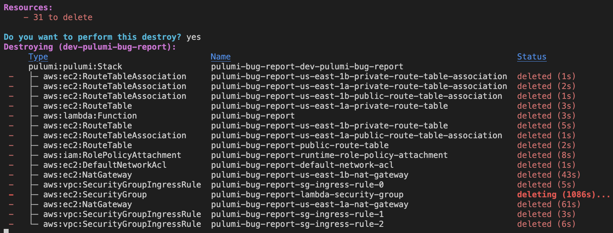

Bug report for https://github.com/pulumi/pulumi-terraform-bridge/issues/1652#issuecomment-2284188134

This repository shows that deleting security groups with a `customTimeout` set does not respect the listed `customTimeout`.

Reproduction steps:
- Create a pulumi stack, then run `yarn run build && CI_COMMIT_SHA=1 pulumi up --yes`
- Run `pulumi down --yes`

Note: lambda security groups take up to 45 minutes to destroy, but it's probably possible for them to destroy under 2 minutes, so **you may need to retry the reproduction steps a few times**.

Expected: Timeout after 2 minutes (as defined in `./pulumi/helpers.ts`, the security group has `customTimeouts: { delete: '2m' }`)

Actual:

